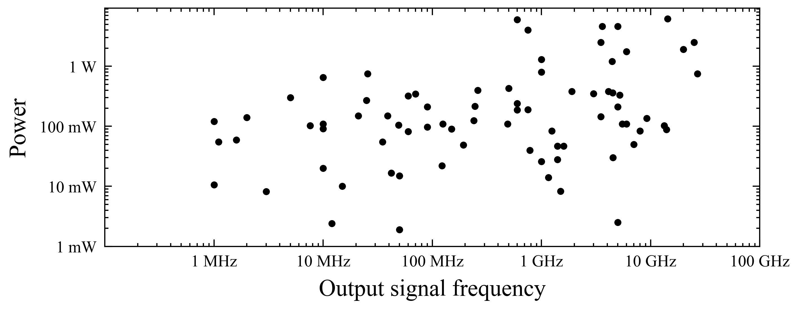
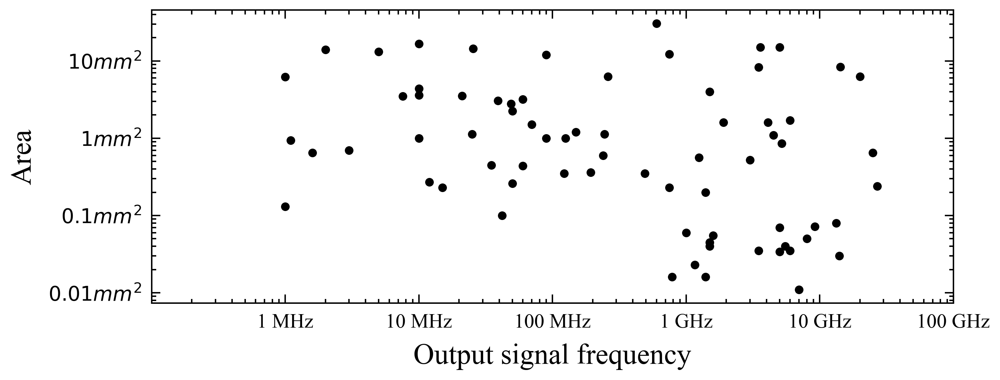
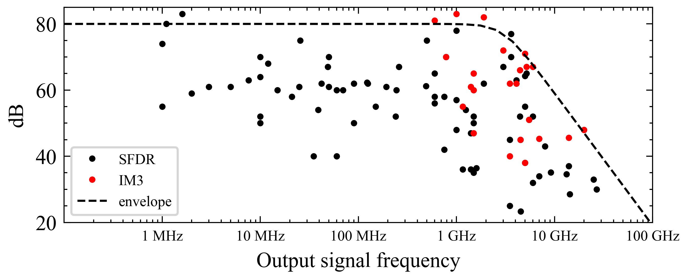

# DAC Performance Survey 1996-2020
----

Authors: Pietro Caragiulo, Clayton Daigle, Boris Murmann (Stanford University)

Revision: 1.0

For use in publications and presentations please cite this data collection as follows:
P. Caragiulo, C. Daigle, B. Murmann, "DAC Performance Survey 1996-2020," [Online]. Available: https://github.com/pietro-caragiulo/survey-DAC.

Access the survey database: <a href="data/data.csv">CSV database</a>

Access the Jupyter Notebook of the survey: <a href="notebook/survey.ipynb">Survey Notebook</a>

Please note that we are incrementally building the database used in this survey. New datapoints for past and future DACs will be added over time.

## Samples
### Power vs Output Frequency

### Area vs Output Frequency

### SFDR/IM3 vs Output Frequency

<tr>
  <td>Visitors</td>
  <td>
    
  </td>  
</tr>
